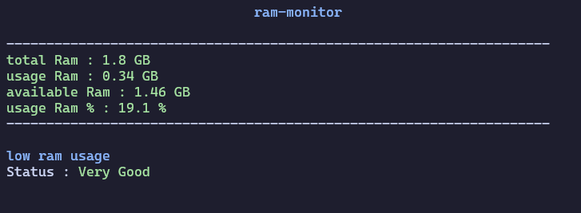

# ram-monitor


A lightweight terminal utility for monitoring system RAM usage in real time.



## Features

* Real-time memory monitoring
* Displays total, used, and available RAM
* Live RAM usage percentage
* Lightweight and easy to use

## What It Displays

* Total RAM
* Used RAM
* Available RAM
* Memory usage percentage
* Current memory status

## Supported Platforms

- Windows
- Linux
- macOS

## Requirements

* Python 3.6 or later
* psutil
* Terminal with ANSI escape sequence support

## Installation

### Clone the repository :

```bash
git clone https://github.com/MohssineX/ram-monitor.git
cd ram-monitor
```

### Install the required dependency :

```bash
pip install psutil
```

## Usage

Run the program :

```bash
python ram-monitor.py
```

If your system uses `python3`:

```bash
python3 ram-monitor.py
```

## License

This project is licensed under the **[GNU General Public License v3.0](https://www.gnu.org/licenses/gpl-3.0.html)**

---

## Author

**Mohssine :**
[https://github.com/MohssineX](https://github.com/MohssineX)

---

## 🐱 Special Thanks

A special thanks to mimi — the legendary, the great, the gentle cat.

---

### If you like it, give it a star :)
